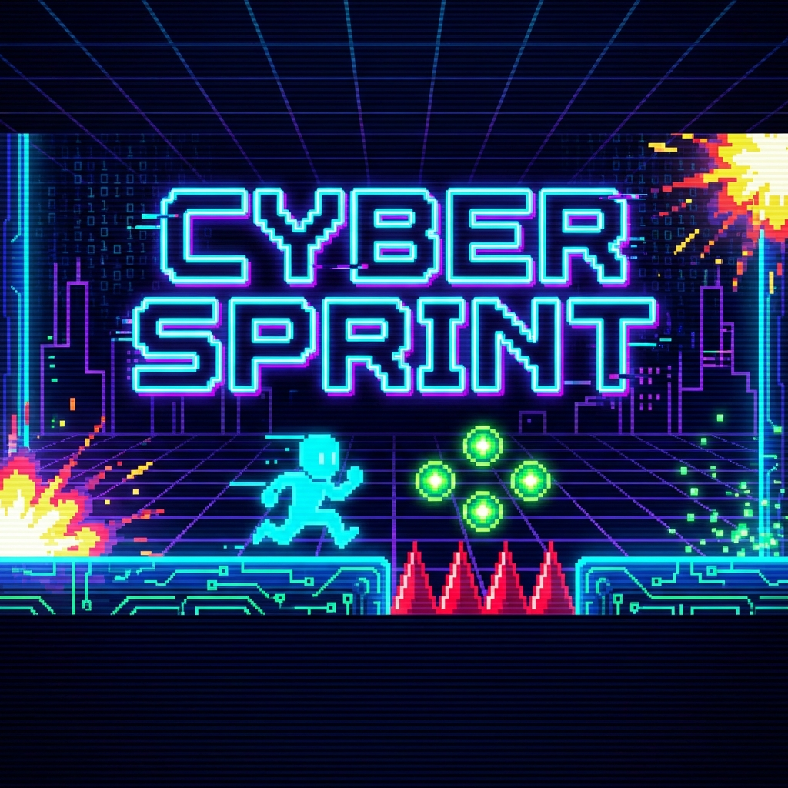

# 🏃 Cyber Sprint: Girls & Boys Day Edition



Willkommen zu **Cyber Sprint** – einem Jump-and-Run-Spiel, das speziell für den Girls & Boys Day entwickelt wurde. In diesem Spiel lernst du spielerisch, wie **Physik** und **Mathematik** in Videospielen funktionieren!

---

## 🎮 So wird gespielt

### Steuerung
| Gerät | Aktion |
|-------|--------|
| **Tastatur** | `Leertaste` = Springen |
| **Maus** | Klick = Springen |
| **Handy/Tablet** | Tippen = Springen |

**Tipp:** Du kannst **doppelt** springen, um höhere Orbs zu erreichen!

### Ziel des Spiels
- 🟢 **Sammle grüne Energie-Orbs** → Du bekommst **+15 Energie** und **+10 Punkte**
- 🔴 **Weiche roten Spikes aus** → Bei Treffer verlierst du **-25 Energie**
- ⚡ Deine Energie startet bei **100%**. Bei **0%** ist das Spiel vorbei!

---

## 🔬 Die Physik dahinter

### Wie funktioniert der Sprung?

Wenn du springst, passiert Folgendes im Code:

```
Beim Sprung: geschwindigkeit = -13   (negativ = nach oben)
Pro Frame:   geschwindigkeit += 0.6  (Schwerkraft zieht nach unten)
             position += geschwindigkeit
```

**Was bedeutet das?**
1. Beim Springen bekommt der Charakter eine **negative Geschwindigkeit** (nach oben).
2. Die **Schwerkraft** (0.6) wird jeden Frame zur Geschwindigkeit addiert.
3. Dadurch wird der Charakter langsamer, stoppt oben, und fällt dann wieder runter.

Das erzeugt die typische **Parabelkurve** eines Sprungs!

---

## 🧮 Die Mathematik dahinter

### Energie-Berechnung

```
Bei Hindernis:  energie = energie - 25
Bei Food:       energie = min(100, energie + 15)
```

**Wichtige Konzepte:**
- `min(100, energie + 15)` bedeutet: Die Energie kann nie über 100% steigen
- Wenn `energie <= 0` → Game Over

### Kollisionserkennung (AABB)

Um zu prüfen, ob der Spieler ein Objekt berührt, nutzen wir **AABB** (Axis-Aligned Bounding Box):

```
Kollision = (spieler.x < objekt.x + objekt.breite) UND
            (spieler.x + spieler.breite > objekt.x) UND
            (spieler.y < objekt.y + objekt.höhe) UND
            (spieler.y + spieler.höhe > objekt.y)
```

---

## 🛠️ Modding: Verändere das Spiel!

Öffne `Experiment_Game.html` in einem Texteditor und suche diese Zeilen:

| Variable | Effekt |
|----------|--------|
| `GRAVITY = 0.6` | Weniger = längere Sprünge |
| `JUMP_FORCE = -13` | Mehr negativ = höhere Sprünge |
| `ENERGY_LOSS = 25` | Weniger = einfacher |
| `ENERGY_GAIN = 15` | Mehr = mehr Heilung |
| `gameSpeed = 5` | Mehr = schneller |

---

## 💻 Spiel starten

1. Öffne `Experiment_Game.html` in einem Browser
2. Klicke auf **STARTEN**
3. Viel Spaß! 🎉

---

*Entwickelt für den Girls & Boys Day*
